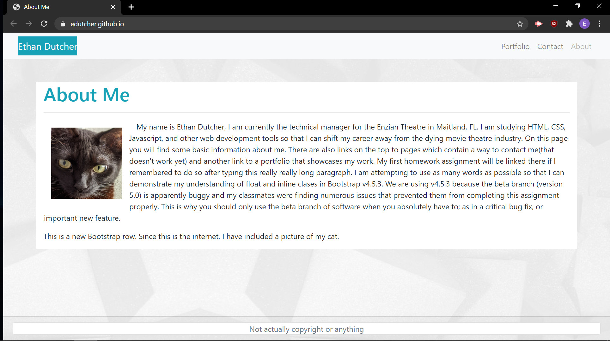

# edutcher.github.io
GitHub Pages Main page

## Description

This is a set of pages to give out some minor information about myself, show off some of my work, and have a place for people to easily contact me.  Currently the contact page does not work and the About Me page has some filler text for formatting reasons.

## Mock-Up and link

The following image shows the main page:

https://edutcher.github.io/index.html

## Credits

I made this :)
Using Bootstrap v4.5.3